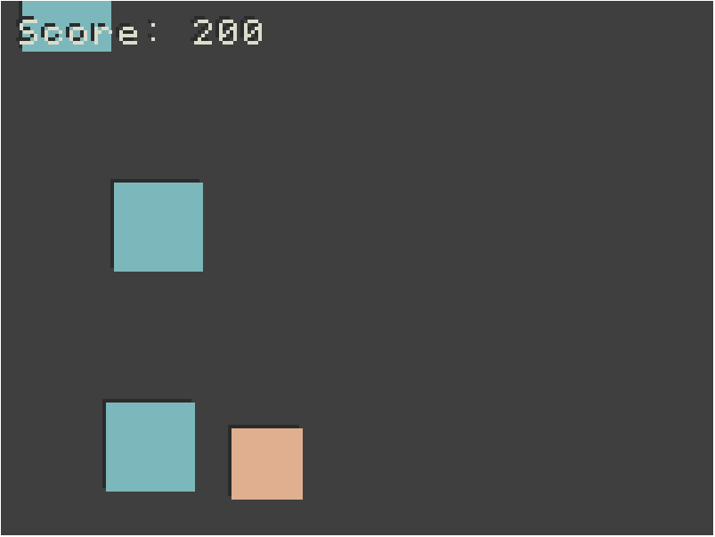

# Bloat-Free Browser Game in Rust (rustc-only challenge)

*Don't blame me if this code breaks in 1 year*



The idea is to make a simple game in [Rust](https://www.rust-lang.org/) as bloat-free as possible using only `rustc` (not using [Emscripten](https://emscripten.org/), [wasm-bindgen](https://github.com/rustwasm/wasm-bindgen), etc.). This could be achieved by using [`wasm32-unknown-unknown`](https://doc.rust-lang.org/nightly/rustc/platform-support.html#tier-2) target directly and developing in [embedded style](https://docs.rust-embedded.org/embedonomicon/smallest-no-std.html).

We still use a little bit of JavaScript to
- Load the WebAssembly module with the logic of the Game,
- Organize the Event Loop,
- Display the Frames generated by the Game in the [HTML5 Canvas](https://developer.mozilla.org/en-US/docs/Web/API/Canvas_API).

**WARNING! The Game is NOT FINISHED yet!**

## Main Technical Idea

The entire logic of the game is contained within the `game.wasm` module that renders the frames of the game into its own memory. The JavaScript part of the applications (`index.js`) constantly takes those frames directly from the memory, puts them into [ImageData](https://developer.mozilla.org/en-US/docs/Web/API/ImageData) and displays them on the [HTML5 Canvas](https://developer.mozilla.org/en-US/docs/Web/API/Canvas_API).

## Bitmap Font

The embedded bitmap font was compressed with [domsson-fontgen](https://github.com/tsoding/domsson-fontgen).

## Portability

The game is extremely portable. Here are some of the existing alternative "frontends" for it:
- [rust-browser-game-but-sdl](https://github.com/tsoding/rust-browser-game-but-sdl)
- [rust-browser-game-but-ncurses](https://github.com/tsoding/rust-browser-game-but-ncurses)

## Running the Game locally

Building step is optional. The compiled version of the game (`game.wasm`) is committed into the repo just in case you wanna quickly check the game without wrestling with the Rust compiler.

1. Start an HTTP Server (for example Python's SimpleHTTPServer):

```console
$ python3 -m http.server 6969
```

2. Play the game

```console
$ iexplore http://localhost:6969/
```

## Building `game.wasm`

It is assumed that you are using [rustup](https://rustup.rs/) for managing your local Rust installation.

1. Make sure you have `wasm32-unknown-unknown` target installed (you only need to do it once):

```console
$ rustup target install wasm32-unknown-unknown
```

2. Build the game

```console
$ make -B
```

## Game Controls

- Mouse mouse cursor to position the player
- Click to shoot
- <kbd>SPACE</kbd> to toggle pause
